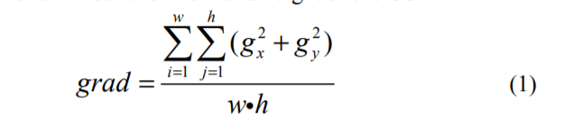

# Adaptive CU Split Decision with Pooling-variable CNN for VVC Intra Encoding
## 创新点
&nbsp;&nbsp;&nbsp;&nbsp;&nbsp;&nbsp;&nbsp;&nbsp;作者在这篇论文中引入了CNN来解决CU划分的问题。其创新点使用了一个自适应的策略来解决VVC中不同尺寸CU输入CNN的难题。该自适应的策略和以前直接下采样输入的图像为同一大小或裁剪输入图像为大小的子块不同，作者提出的自适应策略利用了池化层不需要额外参数进行学习的特点，因此把不同的CU送入神经网络得到特征图通过不同大小的池化层处理得到相同大小的特征图，之后再把相同尺寸大小的特征图送入全连接层得到预测结果。该过程的示意图见图1。

&nbsp;&nbsp;&nbsp;&nbsp;&nbsp;&nbsp;&nbsp;&nbsp;在对数据进行flatten之后，作者还引入了三条信息添加到flatten之后的数据中，这三条信息分别是QP、输入CU的宽和高，论文中作者说这三条信息与是否对CUN进行划分的判断有影响。

&nbsp;&nbsp;&nbsp;&nbsp;&nbsp;&nbsp;&nbsp;&nbsp;其次，作者并不是对所有的CU都送入CNN进行判断，而是在送入网络之前就做了一个简单的预判。预判的公式见公式（2），其主要计算一个CU的梯度，然后结合QP得到一个预判的条件来决定对该CU的处理。 

## 实验结果

作者提出的算法能在仅仅增加0.99% BD-rate的情况下节约33.41%的时间。