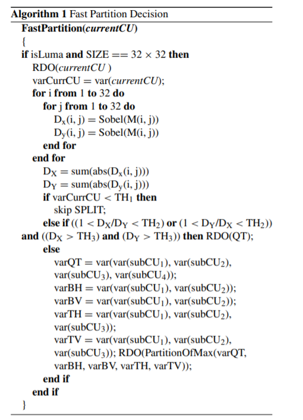
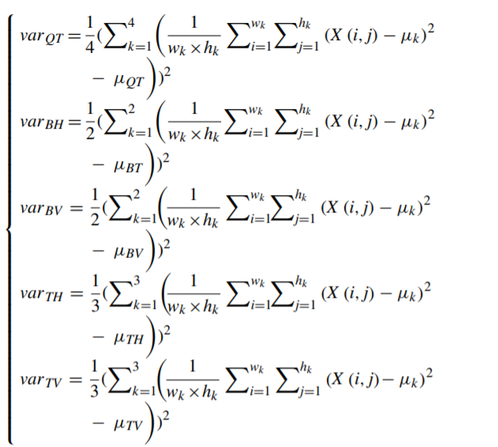
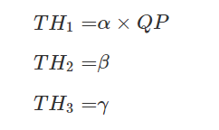
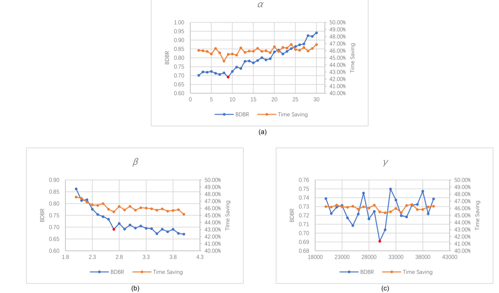
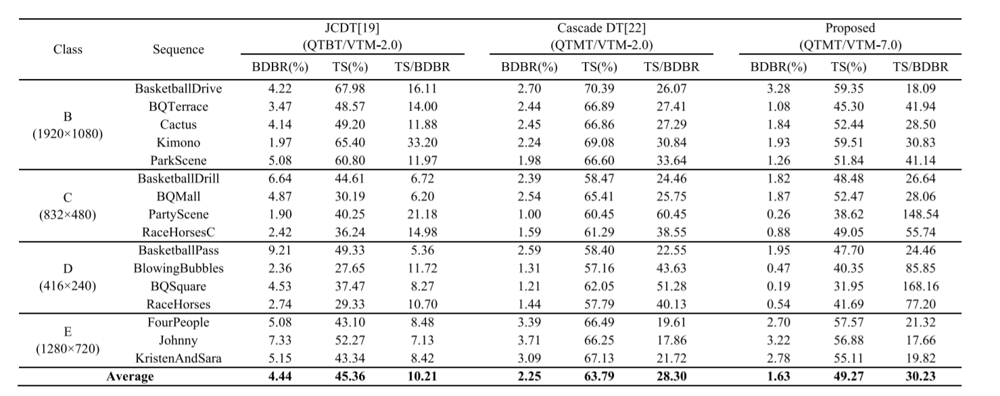
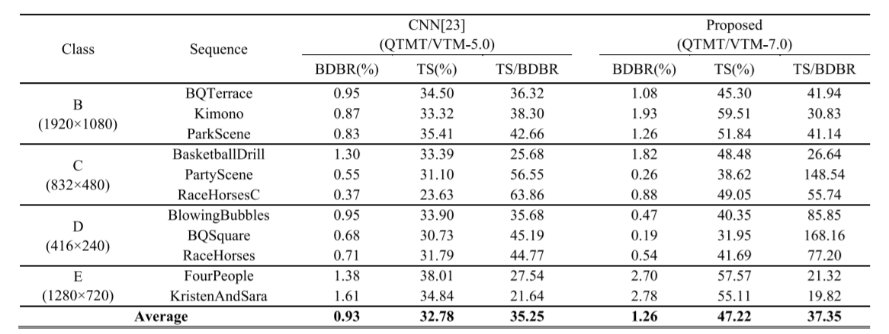

# A Fast QTMT Partition Decision Strategy for VVC Intra Prediction
> [link](https://ieeexplore.ieee.org/document/9110597)
## Abstract
Different from the traditional quaternary tree (QT) structure utilized in the previous generation
video coding standard H.265/HEVC, a brand new partition structure named quadtree with nested multitype tree (QTMT) is applied in the latest codec H.266/VVC. The introduction of QTMT brings in superior
encoding performance at the cost of great time-consuming. Therefore, a fast intra partition algorithm based
on variance and Sobel operator is proposed in this paper. The proposed method settles the novel asymmetrical
partition issue in VVC by well balancing the reduction of computational complexity and the loss of encoding
quality. To be more concrete, we first terminate further splitting of a coding unit (CU) when the texture of
it is judged as smooth. Then, we use Sobel operator to extract gradient features to decide whether to split
this CU by QT, thus terminating further MT partitions. Finally, a completely novel method to choose only
one partition from five QTMT partitions is applied. Obviously, homogeneous area tends to use a larger CU
as a whole to do prediction while CUs with complicated texture are prone to be divided into small sub-CUs
and these sub-CUs usually have different textures from each other. We calculate the variance of variance
of each sub-CU to decide which partition will distinguish the sub-textures best. Our method is embedded
into the latest VVC official reference software VTM-7.0. Comparing to anchor VTM-7.0, our method
saves the encoding time by 49.27% on average at the cost of only 1.63% BDBR increase. As a traditional
scheme based on variance and gradient to decrease the computational complexity in VVC intra coding, our
method outperforms other relative existing state-of-the-art methods, including traditional machine learning
and convolution neural network methods.

## 概述
作者在这篇论文中提出了一种基于方差和Sobel算子的快速帧内分割算法。首先判断一个CU是否平滑,若平滑则停止进一步划分。否则利用Sobel算子提取梯度特征，以决定是否通过QT拆分此CU，从而停止进一步的MT划分。 最后，作者在这篇论文提出了一个新的策略从五个QTMT中选择一个划分模式。
算法的伪代码如下：

该算法只适用于Y通道，因此算法第一步就是判断通道，在Cu的尺寸和通道都满足的情况下就开始计算当前Cu的RDO和方差。接着利用Sobel算子计算当前CU的梯度并进行绝对值累加求和得到DX和DY。然后把DX和DY阈值TH1进行比较，若小于TH1，则不进行划分，若大于TH1则进行进一步判断。如果DX和DY满足条件(1<DX/DY< TH2) or (1<DY/DX< TH2)) and ((DX> TH3) and (DY> TH3)则利用QT进行划分从而省去了MT的判断，节约了时间，否则分别按公式计算MT划分中的方差的方差，选择方差最大的模式作为划分的模式。计算方差的方差的公式如下：

阈值TH1、TH2、TH3的计算方式如下：

α、β、γ都是参数，作者根据DIV2K数据集进行实验，选取了(α , β , γ ) 的值为(9, 2.7, 30000)。

**实验结果如下：**

